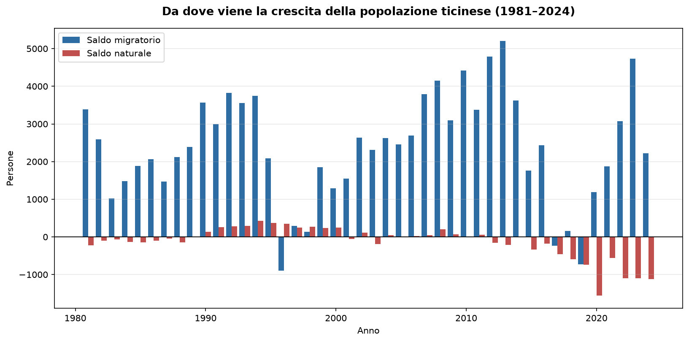
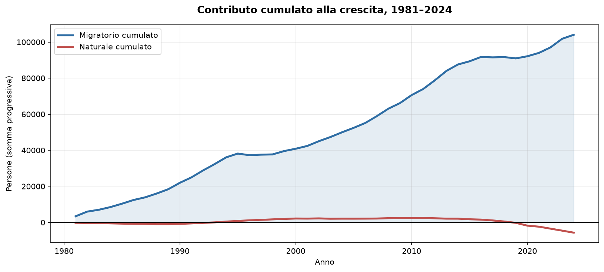

# Crescita naturale e migratoria della popolazione ticinese, 1981–2024
**Grafici interattivi:**
[▶ Saldi annuali](https://lupertojoele-max.github.io/analisi-demografia-ticino/grafico_interattivo.html) · [▶ Contributo cumulato](https://lupertojoele-max.github.io/analisi-demografia-ticino/grafico_cumulato.html)

## Domanda

Dal 1981 a oggi, quanta parte della crescita della popolazione ticinese
viene dalla differenza tra nascite e decessi, e quanta dai movimenti migratori?

## Risultato principale

In 44 anni il Ticino è cresciuto di **98'346 persone**.

| Componente | Contributo cumulato |
|---|---|
| Saldo naturale (nati − morti) | **−5'692** |
| Saldo migratorio | **+104'038** |
| Crescita totale | **+98'346** |

Il saldo naturale ha sottratto popolazione. Senza migrazione il Ticino
non sarebbe cresciuto: sarebbe diminuito.

Il saldo naturale è stato negativo in **25 anni su 44**, ma non in modo
uniforme: positivo tra il 1990 e il 2019, poi in caduta. Il 2020 segna
il minimo (−1'561), e dal 2022 il deficit resta stabilmente sopra le
mille unità l'anno.

Il grafico cumulato mostra che i guadagni naturali accumulati in trent'anni
sono stati annullati in cinque.

## Metodo

1. Filtro del dataset sul livello geografico "Ticino" (cantone intero),
   con i totali di sesso e nazionalità per evitare doppi conteggi
2. Selezione delle statistiche *Incremento naturale* e *Saldo migratorio*
3. Trasformazione da formato lungo a formato largo (`pivot_table`):
   una riga per anno, una colonna per componente
4. Calcolo della crescita totale e della quota migratoria
5. Visualizzazione: barre affiancate per l'andamento annuale,
   somme progressive per il contributo cumulato

## Limiti

- La **quota percentuale della migrazione** perde significato quando la
  crescita totale è vicina a zero o negativa: nel 2024 risulta il 200,8%,
  nel 2020 il −317,4%. Per questo l'analisi si basa sui valori assoluti.
- Il saldo